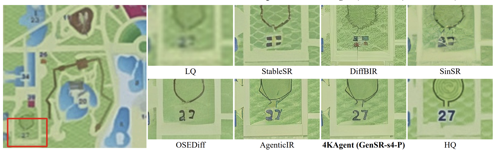
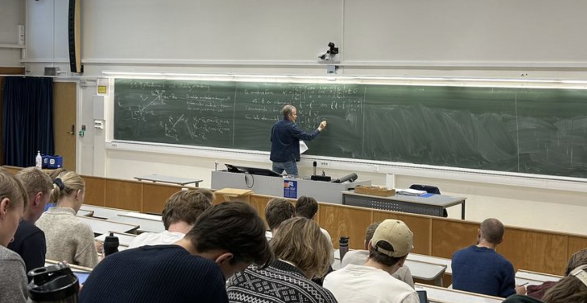

# GIRAFFE

### Guided Image Restoration Agent for Fidelity and Fact Evaluation

> Исследовательский проект по восстановлению изображений с использованием
> мультимодального рассуждения, семантических знаний и верификации результата.

## О проекте

Современные генеративные модели умеют превращать деградированные изображения в
визуально убедительные, но могут создавать правдоподобные и при этом неверные
детали: изменять текст, лица, форму объектов и структуру сцены. Обычные метрики
качества часто не замечают такие ошибки, поскольку оценивают визуальную
естественность, а не соответствие наблюдаемым данным и доступным знаниям.

**GIRAFFE** — агентная система восстановления изображений с мультимодальным
анализом сцены, использованием пользовательских подсказок и внешних знаний,
генерацией нескольких вариантов, семантической проверкой, контролем
согласованности с исходными пикселями и оценкой неопределённости.

## Участники

**Исполнитель:** Марк Бондаренко

**Куратор:** Марк Блуменау

## Мотивационные примеры

### Повторяющиеся подписи на карте

На карте другие подписи задают общий визуальный шаблон: одинаковые цвет, шрифт
и толщина символов. Тем не менее StableSR, DiffBIR и SinSR превращают размытую
подпись во флагоподобные структуры, AgenticIR меняет число на `37`, а 4KAgent
восстанавливает `27`, но не сохраняет стиль эталона. Система с рассуждением могла
бы извлечь стиль из читаемых подписей, построить несколько гипотез для цифр и
отбросить варианты, не согласующиеся с исходными пикселями.

Источник: Figure 10 из статьи
<a href="https://arxiv.org/abs/2507.07105">4KAgent: Agentic Any Image to 4K Super-Resolution</a>.

### Записи с занятия по линейной алгебре

На фотографии из дальней части аудитории формулы на доске различимы лишь
частично. Дополнительное знание «это занятие по линейной алгебре» сужает
множество возможных интерпретаций: на доске ожидаются матрицы, векторы, системы
линейных уравнений и связанные с ними обозначения. Соседние строки дают ещё один
источник информации — повторяющиеся символы и последовательные преобразования.
Система может использовать этот контекст для построения и проверки вариантов
восстановления, сохраняя неоднозначность там, где исходных пикселей всё равно
недостаточно для однозначного ответа.

Эти примеры иллюстрируют общий класс задач: использовать повторяющуюся структуру,
смысл сцены и доступные знания как ограничения, не подменяя ими свидетельства
исходного изображения.

## Исследовательский вопрос и гипотеза

Исследование проверяет, позволяет ли мультимодальное рассуждение уменьшить число
семантических ошибок по сравнению с обычными restoration-моделями и прямым
prompt-guided восстановлением. Гипотеза: если система извлекает ограничения из
повторяющихся элементов изображения, логических связей между его частями,
пользовательского описания и внешних знаний, а затем проверяет сгенерированные
варианты на соответствие этим ограничениям и исходным пикселям, то она будет
реже искажать числа, текст и структуру объектов при сопоставимом визуальном
качестве.

## Ожидаемые результаты

- benchmark с семантически сложными примерами и воспроизводимыми baseline;
- прототип agentic restoration с семантической и пиксельной верификацией;
- экспериментальное сравнение и ablation study;
- демонстрационный интерфейс и исследовательский отчёт.

## План работы

План намеренно сформулирован верхнеуровнево: конкретные методы, датасеты и
метрики будут выбраны после обзора литературы и первых экспериментов.

| Контрольные точки | Направление работы | Результат |
|---|---|---|
| **КП 1** | Уточнить тему, исследовательский вопрос и гипотезу; оформить репозиторий. | Зафиксированная постановка задачи и план проекта. |
| **КП 2–3** | Изучить современные методы восстановления изображений, подобрать данные и воспроизвести несколько базовых подходов. | Обзор литературы, тестовый набор примеров и baseline. |
| **КП 4 и промежуточная защита** | Собрать первый прототип восстановления с использованием описания изображения или дополнительных знаний. | Работающий прототип и первые результаты сравнения. |
| **КП 5–6** | Развить метод, добавить проверку восстановленных деталей и провести основные эксперименты. | Итоговая версия метода и экспериментальная оценка гипотезы. |
| **КП 7 и итоговая защита** | Проанализировать результаты и ограничения, подготовить демонстрацию и отчёт. | Завершённый проект, документация и презентация. |

План будет уточняться вместе с куратором по мере появления результатов.
